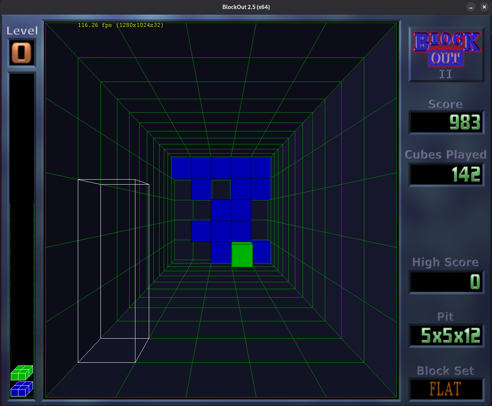

# BlockOut II v2.5



**3D Tetris-tyylinen palapeliä**

BlockOut II on OpenGL-sovitus alkuperäisestä BlockOut DOS-pelistä, jonka California Dreams julkaisi vuonna 1989. BlockOut II:ssa on samat ominaisuudet kuin alkuperäisessä pelissä muutamilla graafisilla parannuksilla. Pisteiden laskenta on myös lähes samanlainen kuin alkuperäisessä pelissä. BlockOut II on suunniteltu riippuvaiselle pelaajalle riippuvaisia pelaajia varten.

Pidä hauskaa BlockOut II:n kanssa...

---

*Blockout® on Kadon Enterprises, Inc.:n rekisteröity tavaramerkki, jota käytetään luvalla. Tämä yhdysvaltalainen yritys on valmistanut käytännöllisiä polykuutioita vuodesta 1980. [www.gamepuzzles.com](http://www.gamepuzzles.com)*

---

## 🌐 Virallinen Kotisivu

**http://www.blockout.net/blockout2**

## 🌍 Kielet / Idiomas / Langues

- [English](../README.md)
- [Español](README.es.md)
- [Português](README.pt.md)
- [Français](README.fr.md)
- [Italiano](README.it.md)
- [Deutsch](README.de.md)
- [Polski](README.pl.md)
- [Română](README.ro.md)
- [中文](README.zh.md)
- [日本語](README.ja.md)
- [Gaeilge](README.ga.md)
- [Ελληνικά](README.el.md)
- [Nederlands](README.nl.md)
- [Dansk](README.da.md)
- [Català](README.ca.md)
- [Norsk](README.no.md)
- [Čeština](README.cs.md)
- [Suomi](README.fi.md) (tämä tiedosto)
- [Svenska](README.sv.md)
- [Eesti](README.et.md)
- [Türkçe](README.tr.md)
- [Afrikaans](README.af.md)
- [العربية](README.ar.md)

## 🤝 Liity Kansainväliseen Tiimiimme!

**Kutsumme kaikki nuoret kehittäjät CoderDojosta ja Code Clubista!** 🌍

Rakennamme kansainvälistä tiimiä tehdäksemme BlockOut II:sta saavutettavan pelaajille ympäri maailmaa **23 kielellä**. Olitpa sitten aloittelija tai kokenut ohjelmoija, sinulle on paikka!

**Mitä opit:**
- 🌐 Kansainvälistäminen (i18n) ja lokalisointi
- 💻 Pelien kehitys C++:lla
- 🔧 Käännösjärjestelmät ja CI/CD
- 🤝 Globaali yhteistyö

**Miten voit osallistua:**
- 📝 Käännä peli omalle kielellesi
- 🎨 Luo lokalisoituja fontteja ja grafiikkaa
- 🧪 Testaa eri alustoilla
- 🔨 Paranna käännösjärjestelmää
- 🎮 Lisää uusia ominaisuuksia

👉 **[Lue CONTRIBUTING.md](../CONTRIBUTING.md) aloittaaksesi!**

## 📦 Lataukset

Hanki uusin versio alustallesi [Julkaisut-sivulta](https://github.com/coderdojo-cordoba/blockout2025/releases):

- **Windows**: `blockout-windows-*.zip` - Pura ja suorita `Blockout.exe`
- **Linux (Yleinen)**: `blockout-linux-x64-*.tar.gz` - Pura ja suorita `./blockout/blockout`
- **macOS**: `blockout-macos-*.tar.gz` - Pura ja suorita binääri
- **Ubuntu/Debian**: `blockout_*.deb` - Asenna komennolla `sudo dpkg -i blockout_*.deb`
- **Fedora/RHEL**: `blockout-*.rpm` - Asenna komennolla `sudo dnf install blockout-*.rpm`
- **Arch Linux**: `blockout-*.pkg.tar.zst` - Asenna komennolla `sudo pacman -U blockout-*.pkg.tar.zst`

## 🎮 Järjestelmävaatimukset

### Windows
- OpenGL-tuki

### Linux
**Suoritusaika:**
- `libgl1-mesa`
- `libglu1-mesa`
- `libxext6`
- `libsdl1.2`
- `libsdl-mixer1.2`

**Käännösriippuvuudet:**
- `build-essential`
- `libgl1-mesa-dev`
- `libglu1-mesa-dev`
- `libxext-dev`
- `libsdl1.2-dev`
- `libsdl-mixer1.2-dev`
- `libasound2-dev`

### macOS
- SDL 1.2 (sdl12-compat kautta)
- SDL_mixer 1.2
- OpenGL

## 📝 Versiohistoria

### 2.5
- 64-bittinen tuki
- OpenGL:ää käytetään nyt sekä Linuxissa että Windowsissa
- Pieniä graafisia parannuksia
- Harjoitustilan parannuksia
- Parannettu demotila (Bot-pelaaja pelaa paremmin)
- Paikallinen datahakemisto siirretty asennushakemistosta "AppData"-hakemistoon

### 2.4
- Lisätty kehysten rajoitin
- Lisätty demotila
- Lisätty harjoitustila
- Korjattu toiston virhe
- Korjattu satunnaislukugeneraattori (FLAT-lohkosarja)
- Korjattu koko näytön virhe (Linux)

### 2.3
- Lisätty pelaajan/sijoituksen nimi toiston aikana
- Lisätty uusia välimerkkejä
- Pieni efekti kun kierto on estetty
- Korjattu "Ei voi avata blX.bl2replay kirjoitusta varten"
- Uusi tyyli (Marmori/Arcade)
- Korjattu kaatuminen painettaessa [Esc]
- Kuopan animaatio pelin päättyessä
- Siirry Pisteiden Tiedot -sivulle pelin päätyttyä
- Lisätty DOS blockout ääniesiasetukset
- Uusi satunnaistaja

### 2.2
- Lisätty NUMPAD-näppäinohjaus
- Lohkojen läpinäkyvyys säädettävissä liukusäätimellä
- Keskeytä valikon käynnistysesittely [Esc]-näppäimellä
- Lisätty tyhjä kuoppa (Flush) pisteiden tietoihin
- Online-pistetietokanta
- Toisto
- Lisätty tekijätiedot-sivu
- Muita pieniä päivityksiä

### 2.1
- Korjattu lohkojen laskeutumisalgoritmi
- Hieman kasvatettu putoamisaikaa
- Parannettu liikkeen nopeuden säätöä

### 2.0
- Ensimmäinen julkaisu

## 🔧 Kääntäminen Lähdekoodista

### Ubuntu/Debian

**Automaattinen:**
```bash
sudo ./install-ubuntu-deps.sh
./build-and-run.sh
```

**Manuaalinen:**
```bash
# Asenna riippuvuudet
sudo apt-get install build-essential libgl1-mesa-dev libglu1-mesa-dev \
  libxext-dev libsdl1.2-dev libsdl-mixer1.2-dev libasound2-dev

# Käännä ImageLib
make -C ImageLib/src

# Käännä BlockOut
make -C BlockOut _linux64=1 _release=1

# Suorita
cd BlockOut
./blockout
```

### Windows

1. Asenna Microsoft Visual Studio 2022 (tai 2019/2017)
2. Asenna SDL 1.2.15 kehityskirjastot osoitteesta [libsdl.org](http://www.libsdl.org)
3. Asenna SDL_mixer 1.2.12 kehityskirjastot osoitteesta [libsdl.org](http://www.libsdl.org/projects/SDL_mixer/release-1.2.html)
4. Aseta asianmukaiset include- ja lib-polut projektin ominaisuuksiin
5. Käännä ratkaisu

### macOS

```bash
# Asenna riippuvuudet Homebrew'n kautta
brew install sdl12-compat pkg-config

# Käännä SDL_mixer 1.2 lähdekoodista (katso .github/workflows/build-macos-brew.yml)

# Käännä ImageLib
make -C ImageLib/src

# Käännä BlockOut
make -C BlockOut _macos=1

# Suorita
cd BlockOut
./blockout
```

## 🤖 GitHub Actions CI/CD

Tämä repositorio käyttää GitHub Actionsia automaattiseen kääntämiseen ja julkaisuun kaikilla alustoilla.

### Saatavilla Olevat Työnkulut

#### Käännöstyönkulut (Automaattiset)

- **`build-windows.yml`** - Kääntää Windows x64 -binäärit
- **`build-macos-brew.yml`** - Kääntää macOS-binäärit
- **`build-fedora-rpm.yml`** - Kääntää RPM-paketit
- **`build-arch-pkg.yml`** - Kääntää Arch Linux -paketit
- **`package-deb.yml`** - Kääntää Debian-paketit

#### Julkaisutyönkulku (Manuaalinen)

- **`create-release.yml`** - Luo uuden julkaisun

### Julkaisuprosessi

1. Varmista, että kaikki muutokset on yhdistetty `development`-haaraan ja testattu
2. Siirry GitHub Actions → "Create Release" -työnkulku
3. Napsauta "Run workflow"
4. Syötä versionumero (esim. `v2.5.0`)
5. Työnkulku yhdistää, merkitsee, kääntää ja julkaisee

## 🎯 Pelin Ominaisuudet

### Toistojärjestelmä
Jokaisesta tekemästäsi huipputuloksesta luodaan `.bl2replay`-tiedosto toistohakemistoon.

### Pisteiden Lataus
Lataa huipputuloksesi online-tietokantaan Pisteiden Tiedot -sivulta.

### Satunnaistaja
BlockOut II käyttää pussi-satunnaistajaa, joka generoi kaikkien mahdollisten palojen satunnaisesti permutoidun sekvenssin.

### Kehysten Rajoitin
Synkronoidaksesi animaatiot näyttösi pystysuuntaisen sammutuksen kanssa, valitse VSync kehysten rajoittimen asetuksista.

## 📜 Lisenssi

Tämä ohjelma on vapaata ohjelmistoa; voit jakaa sitä edelleen ja/tai muokata sitä GNU General Public License -ehtojen mukaisesti.

## 👤 Tekijä

Jean-Luc PONS (jlp_38@yahoo.com)

## 🔗 Linkit

- [Virallinen Verkkosivusto](http://www.blockout.net/blockout2)
- [GitHub-repositorio](https://github.com/coderdojo-cordoba/blockout2025)
- [Kadon Enterprises](http://www.gamepuzzles.com)
